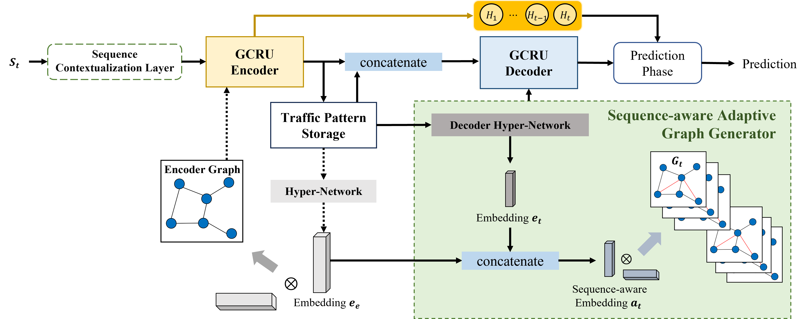

# 🚦 SAGCRN: Sequence-aware Adaptive Graph Convolutional Networks for Traffic Forecasting  

<p align="center">
  
  <br>
  <em>Sequence-aware Adaptive Graph Convolutional Network (SAGCRN)</em>
</p>

## 📌 Introduction  
We propose **SAGCRN**, a **sequence-aware adaptive graph convolutional network** for traffic forecasting.  
Unlike conventional static graph-based models, SAGCRN dynamically learns **sequence-aware dependencies** among traffic sensors.  
This adaptive mechanism allows the model to better capture evolving traffic dynamics across time and location.  

## 📰 News
- **[2025/09/21]** Our paper MR-Prner has been accepted to **_Knowledge-Based Systems 2025_**!🎉  

---

## ⚙️ Installation  
SAGCRN is implemented with **PyTorch** and standard scientific Python libraries.

```bash
# Clone repository
git clone https://github.com/gooriiie/SAGCRN.git
cd SAGCRN

# Create environment
conda create -n sagcrn python=3.8
conda activate sagcrn
```

### Required packages
- python 3.8.16
- pytorch 1.10.1
- pandas 1.5.3
- numpy 1.23.2
- torch-summary 1.4.5


## 🧩 Datasets  
You can download all datasets from [Google Drive](https://drive.google.com/drive/folders/1Q7Ec6I1i2al_CWt7bPQalYHY4y7e_Tkl?usp=sharing).  
After downloading, place and unzip them into the corresponding directory:  
```
data/  
├── METR-LA/  
├── PEMS-BAY/  
└── PEMS08/  
```

## 🚀 Run  

Run training and evaluation with default settings:

```bash
cd model
python traintest_SAGCRN.py --dataset METRLA --gpu 0
```

## 📊 Experimental Results  

| Dataset | Horizon | MAE | RMSE | MAPE |
|:---------|:-----|:---------|:---------|:---------|
| METR-LA  | 12   | **3.20** | **6.97** | **9.25%** |
| PEMS-BAY | 12   | **1.86** | **4.34** | **4.36%** |
| PEMS08   | 12   | **14.55** | **24.89** | **9.77%** |


## 🧾 Citation  
If you use this repository or find SAGCRN helpful in your research, please cite:

```bibtex
@article{han2025sequence,
  title={Sequence-aware Adaptive Graph Convolutional Recurrent Networks for Traffic Forecasting},
  author={Han, Seunghoon and Lee, Hyewon and Lee, Daniel Y and Kim, Sung-Soo and Yoon, Susik and Lim, Sungsu},
  journal={Knowledge-Based Systems},
  pages={114533},
  year={2025},
  publisher={Elsevier}
}

